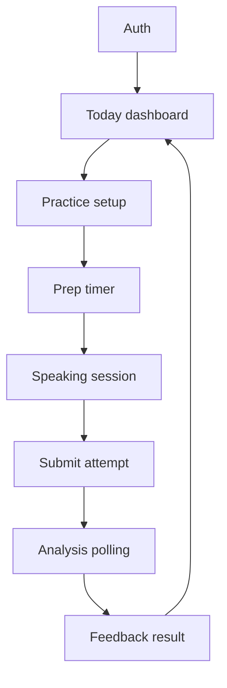
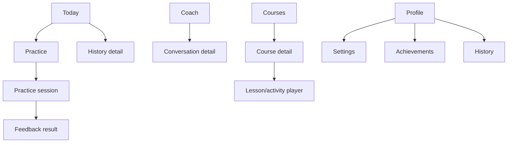

# Student App Map

This map turns the current student-facing web product into an iOS screen plan. Scope labels:

- `Prototype`: required for the 2026-05-28 first-week prototype.
- `V1`: required for the 2026-07-02 TestFlight-ready student app.
- `Deferred`: keep web-only or move after TestFlight unless priorities change.

## Navigation Model

Recommended iOS shell:

- `Today`: dashboard, streak, XP/level, recommended drill, quick actions.
- `Practice`: topic picker, setup, prep, speaking, feedback entry points.
- `Coach`: AI coach chat and suggested next actions.
- `Courses`: course library, course detail, lesson/activity player.
- `Profile`: profile, achievements, history shortcut, settings, preferences.

Use fullscreen modals for prep/speaking sessions and result/detail flows where focus matters.

## Web-To-Mobile Map

| Current Web Surface | Current Route/Area | iOS Target | Scope | Notes |
| --- | --- | --- | --- | --- |
| Login | `src/app/[locale]/auth/login/page.tsx` | Auth stack: sign in | Prototype | Must support Google and Sign in with Apple through Supabase mobile auth. |
| Signup | `src/app/[locale]/auth/signup/page.tsx` | Auth stack: create account | Prototype | Same deep-link redirect handling as login. |
| Onboarding | `src/app/[locale]/onboarding/page.tsx` | First-run onboarding | V1 | Can be abbreviated for prototype if auth can reach dashboard directly. |
| Dashboard | `src/app/[locale]/(protected)/dashboard/page.tsx`, `src/lib/api/dashboard.ts` | `Today` tab | Prototype | Include streak, XP/level, recommended drill, recent practice, quick actions. |
| Practice setup | `src/app/[locale]/(protected)/practice/page.tsx`, `src/lib/topics.ts`, `src/lib/practice-language.ts` | `Practice` tab and setup screens | Prototype | Topic, language, mode, timing, side, and difficulty should map to native controls. |
| Practice session | `src/app/[locale]/(protected)/practice/session/page.tsx` | Fullscreen native practice session | Prototype | Requires Expo microphone permission, native recording, timer, transcript state. |
| Practice feedback | `src/app/[locale]/(protected)/practice/feedback/page.tsx`, `feedback-client.tsx` | Feedback result screen | Prototype | Must submit attempt, poll analysis job, show score/categories/transcript notes. |
| History | `src/app/[locale]/(protected)/history/page.tsx` | History list | V1 | Can be a Profile shortcut or its own stack under Practice/Profile. |
| History detail | `src/app/[locale]/(protected)/history/[id]/page.tsx` | Attempt detail screen | V1 | Reuse feedback display model where possible. |
| Coach chat | `src/app/[locale]/(protected)/chat/page.tsx`, `/api/chat/*`, `src/lib/api/chat.ts` | `Coach` tab | V1 | Validate streaming; provide non-streaming fallback. |
| Courses library | `src/app/[locale]/(protected)/courses/page.tsx` | `Courses` tab | V1 | Course cards, progress, continue action. |
| Course detail | `src/app/[locale]/(protected)/courses/[slug]/page.tsx` | Course detail screen | V1 | Reuse course/module/lesson data model. |
| Lesson player | `src/app/[locale]/(protected)/courses/[slug]/lessons/[lessonSlug]/page.tsx` | Lesson/activity player | V1 | Quiz, flashcard, matching, fill-blank, completion states. |
| Dashboard course pages | `src/app/[locale]/(protected)/dashboard/courses/[courseId]/*` | Course detail/player back-compat | V1 | Consolidate with `Courses` tab instead of duplicating navigation. |
| Profile | `src/app/[locale]/(protected)/profile/page.tsx` | `Profile` tab | V1 | Stats, achievements, streak, account summary. |
| Settings | `src/app/[locale]/(protected)/settings/page.tsx` | Profile settings stack/sheet | V1 | Language, voice, notifications, account/export basics. |
| Streaks/orbs | `src/app/actions/orbs.ts`, `src/lib/api/orbs.ts`, smart popup rules | Today/Profile components | V1 | Keep motivational elements lightweight and native. |
| Notifications/smart popups | `src/app/api/client/smart-popups/*`, `src/lib/smart-popups/*` | Local reminders plus in-app nudges | V1 | Expo notifications for streak reminders; smart popups need mobile-specific presentation. |
| Debate duels | `src/app/[locale]/(protected)/debates/*`, `src/lib/api/debate-duels.ts` | Future social/live debate area | Deferred | Large realtime/speech scope. Do not include in first-week prototype. |
| Clubs | `src/app/[locale]/(protected)/dashboard/clubs/[clubId]/page.tsx` | Future org/class experience | Deferred | Keep web-first until core student app is stable. |
| Admin dashboard | `src/app/[locale]/(protected)/dashboard/admin/*` | Web-only | Deferred | Not part of student iOS app. |
| Email/admin/dev QA | `src/app/[locale]/dev/*`, email/admin routes | Web-only | Deferred | Keep outside iOS scope. |
| Landing page | `src/app/[locale]/page.tsx` | App Store/web acquisition | Deferred | Not an in-app surface. |

## Prototype Screen Stack

## V1 Screen Stack

## Product Notes

- Keep the first viewport useful: the iOS app should open to the actual student dashboard, not a marketing landing page.
- Duolingo-style motivation belongs in progress/streak/achievement feedback; it should not become a mascot-heavy visual system.
- Brilliant-style clarity belongs in practice setup, lesson structure, transcript insights, and feedback explanations.
- Use dense but readable mobile screens: tab navigation, native segmented controls, icon buttons, progress rings, cards for repeated items, and focused fullscreen practice states.
