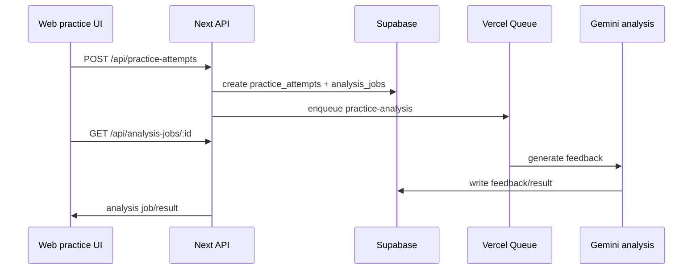

# Technical Audit

This audit identifies the repo areas that affect a full Expo React Native iOS student app. Phase 0 did not change production code.

## Native Scaffold Check

No native scaffold is present.

Checked for:

- `expo`, `react-native`, `capacitor`
- `app.json`, `app.config.*`, `eas.json`, `metro.config.*`
- `ios/`, `android/`

Result: the repo is currently a Next.js web app only.

## Current Web Stack

- Next.js App Router with localized routes under `src/app/[locale]`.
- React 19, TypeScript, Tailwind/CSS app styling.
- Supabase via `@supabase/ssr` and `@supabase/supabase-js`.
- Server Supabase client in `src/lib/supabase/server.ts` is cookie-backed through `next/headers`.
- Browser Supabase client in `src/lib/supabase/client.ts` is SSR/browser oriented.
- Deepgram token grant endpoint plus browser WebSocket transcription hook.
- Async practice analysis through `practice_attempts`, `analysis_jobs`, Vercel Queue, and Google Gemini.
- Coach chat through `/api/chat`, `chat_conversations`, and `chat_messages`.
- Course and dashboard read models in `src/lib/api/*`.

## Shared Candidates For Phase 1

These files are strong candidates for a shared package or explicit import boundary:

- `src/types`
- `src/lib/topics.ts`
- `src/lib/practice-language.ts`
- `src/lib/practice-analysis/types.ts`
- `src/lib/practice-analysis/constants.ts`
- `src/lib/api/dashboard.ts`
- `src/lib/api/chat.ts`
- `src/lib/api/courses.ts`
- `src/lib/api/profile.ts`
- `src/lib/api/coach-profile.ts`
- `src/lib/practice-session-drafts.ts`
- `src/hooks/use-practice-session-draft.ts`

Keep React/Next-specific modules out of shared packages. Shared modules should be pure TypeScript contracts, parser/normalizer helpers, and API response shapes.

## Auth And API Blockers

The web app uses `createClient()` from `src/lib/supabase/server.ts`, which reads and writes Next.js cookies. Mobile requests will carry Supabase access tokens in the `Authorization: Bearer <token>` header instead.

### Prototype Blockers

These routes must accept mobile bearer tokens before the first-week prototype is realistic:

- `src/app/api/practice-attempts/route.ts`: creates practice attempts and analysis jobs.
- `src/app/api/analysis-jobs/[id]/route.ts`: polls analysis results.
- `src/app/api/deepgram-token/route.ts`: grants Deepgram access.
- `src/app/api/analytics/events/route.ts`: records mobile dashboard/practice events.
- `src/app/api/chat/route.ts`: only if coach chat is pulled into prototype.
- `src/app/api/chat/conversations/[id]/route.ts`: only if coach history is pulled into prototype.
- `src/app/api/chat/coach-profile/route.ts`: only if coach context is pulled into prototype.

Recommended Phase 2 decision: create a server auth helper that tries cookie auth first for web, then bearer-token auth for mobile, and returns one normalized authenticated user object. Do not duplicate auth parsing route-by-route.

### TestFlight Blockers

- `src/app/actions/activities.ts`
- `src/app/actions/courses.ts`
- `src/app/actions/enrollment.ts`
- `src/lib/api/courses.ts`
- `src/lib/api/dashboard.ts`
- `src/lib/api/chat.ts`
- `src/lib/api/profile.ts`
- `src/lib/api/coach-profile.ts`
- `src/app/api/tts/route.ts`
- `src/app/api/history/export/route.ts`
- `src/app/api/client/smart-popups/*`

### Deferred/Web-Only For iOS V1

- Admin routes under `src/app/[locale]/(protected)/dashboard/admin/*`
- Club OS admin actions
- Email system admin routes
- Dev QA routes
- Debate duels unless explicitly moved into scope

## Practice And Audio Blockers

Current browser-only areas:

- `src/hooks/use-microphone.ts`: uses `navigator.mediaDevices.getUserMedia`.
- `src/hooks/use-audio-recorder.ts`: uses `MediaRecorder` and `audio/webm;codecs=opus`.
- `src/hooks/use-deepgram-transcription.ts`: uses browser `WebSocket`, `AudioContext`, and `ScriptProcessorNode`.
- `src/app/[locale]/(protected)/practice/session/page.tsx`: reacquires microphone through `getUserMedia`.
- `src/components/practice/audio-visualizer.tsx`: uses `AudioContext`.
- `src/components/practice/audio-check.tsx`: uses `AudioContext`.
- `src/components/practice/mic-check.tsx`: uses `getUserMedia` and `AudioContext`.
- `src/app/[locale]/(protected)/practice/feedback/feedback-client.tsx`: uploads a browser `Blob` as `source.webm`.

The live storage bucket `practice-audio` currently allows only `audio/webm` and `audio/webm;codecs=opus`. iOS recordings commonly produce `m4a`/`aac`, so Phase 5/6 must validate either:

- Expo records directly into an accepted WebM/Opus format, or
- Supabase storage policy and backend processing are updated to allow the selected native iOS format.

Recommended prototype path: use Expo recording to local file, upload after the session, transcribe through a server-mediated fallback if realtime streaming is not stable. Realtime Deepgram streaming can still be explored, but it should not block the May 28 prototype.

## Practice Analysis Flow

Current web path:

Mobile should reuse this pipeline, with a mobile-compatible auth contract and mobile-safe audio/transcript input.

## Phase 1-5 Decisions To Lock

| Decision | Needed By | Recommendation |
| --- | --- | --- |
| Expo workspace shape | Phase 1 | Add Expo app inside the repo and create explicit shared package boundaries. |
| Auth helper contract | Phase 2 | One server helper should support cookie and bearer-token Supabase auth. |
| Deep-link redirects | Phase 2 | Define iOS scheme/universal link redirect URLs before auth implementation. |
| Shared API client | Phase 2 | Mobile should call typed API functions, not fetch raw endpoints from screens. |
| Mobile design primitives | Phase 3 | Translate web tokens into React Native color, spacing, type, state, and icon primitives. |
| Audio format | Phase 5 | Choose Expo recording format and update bucket/backend only after validation. |
| Transcription mode | Phase 5/6 | Prefer recorded upload fallback for prototype; validate realtime streaming separately. |
| Chat streaming fallback | Phase 8 | Test React Native streaming support and keep non-streaming response fallback. |

## Blocker Classification

| Blocker | Classification | Notes |
| --- | --- | --- |
| Bearer-token auth for practice/analysis APIs | Prototype blocker | Needed for attempt submission and polling. |
| Native recording and microphone permission | Prototype blocker | Needed for any real speaking session. |
| Storage format compatibility | Prototype blocker | Current bucket allows WebM only. |
| Dashboard mobile data shape | Prototype blocker | Reuse dashboard concepts but avoid importing server-only code into Expo. |
| Shared package boundaries | TestFlight blocker | Prevents Expo from importing Next-only modules. |
| Google and Sign in with Apple | TestFlight blocker | Required for production iOS auth readiness. |
| Coach chat streaming fallback | TestFlight blocker | Required for reliable mobile coach experience. |
| Course activity parity | TestFlight blocker | Required for full app scope but should follow core practice path. |
| Debate duels | Post-TestFlight | Real-time multiplayer/speech scope is separate from the core student app. |
