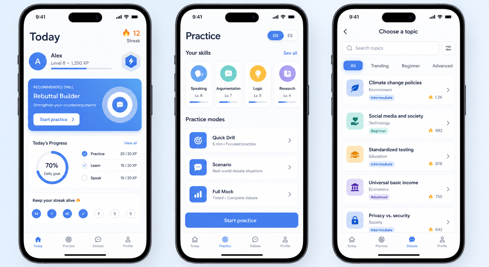
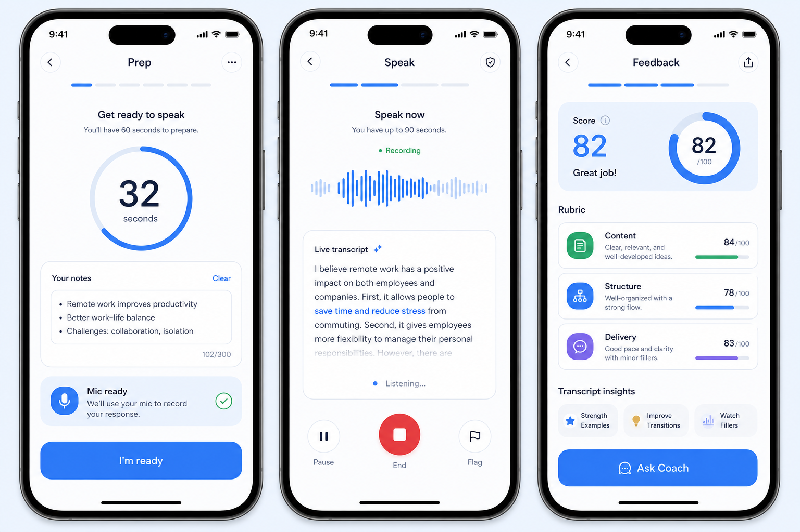
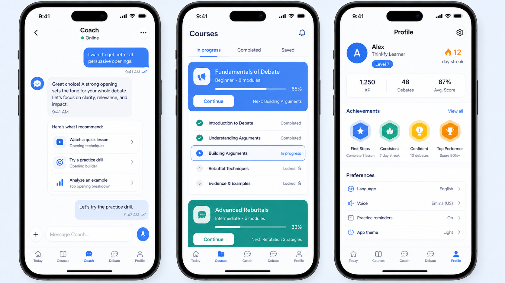

# UI Reference Board

Phase 0 generated three raster boards with built-in imagegen for visual direction only. These are references, not implementation mocks or production UI.

## Generated Boards

### Dashboard And Practice



File: `ui-reference/dashboard-practice-reference.png`

Prompt summary:

- Three iPhone screens for daily dashboard, practice launchpad, and topic picker.
- Thinkfy calm blue visual system: `#4D86F7`, `#A9C6FB`, `#F7FAFE`, white surfaces, soft borders.
- Duolingo-style progress/streak motivation plus Brilliant-style learning clarity.
- Required details: streak, XP/level, recommended drill, progress ring, topic cards, language toggle, primary CTA, compact bottom tabs.

Takeaways for Phase 3:

- `Today` should lead with one strong recommended action, then progress/streak context.
- Practice modes should be scannable rows with icons and short supporting labels.
- Topic picker should prioritize filter/search, difficulty, category, and popularity without feeling like a web table.

### Practice And Feedback



File: `ui-reference/practice-feedback-reference.png`

Prompt summary:

- Three iPhone screens for prep timer, live speaking/transcript, and AI feedback result.
- Native speaking flow with timer, mic readiness, waveform, transcript, score ring, rubric cards, transcript insight chips, and Ask Coach action.
- Calm blue system with clear high-contrast states.

Takeaways for Phase 3:

- Speaking should be a focused fullscreen flow, not a dashboard card.
- Prep, speaking, and feedback need a visible step indicator so students understand where they are.
- Feedback should combine a top-level score with short category evidence and a clear coach follow-up.

### Coach, Courses, And Profile



File: `ui-reference/coach-courses-profile-reference.png`

Prompt summary:

- Three iPhone screens for coach chat, course progress, and profile/achievements/settings.
- Thinkfy calm blue and white, achievement motivation, clear course structure.
- Required details: suggested coach actions, module progress, lesson cards, badges, streak, voice/language preferences, bottom tabs.

Takeaways for Phase 3:

- Coach should be action-oriented, with suggested next steps that connect to lessons and practice.
- Course progress should feel structured and compact, with a strong continue action.
- Profile should combine identity, stats, achievements, and preferences without burying reminders/settings.

## Design Direction To Carry Forward

- Use Thinkfy blue as the anchor, but keep supporting accents varied enough to avoid a one-note blue UI.
- Keep cards for repeated items and focused panels; do not turn whole pages into nested card layouts.
- Prefer native controls: bottom tabs, segmented controls, icon buttons, switches, sliders/steppers, sheets, and fullscreen practice states.
- Preserve motivation through progress, streaks, XP, badges, and celebratory feedback rather than mascots.
- Preserve learning clarity through concise labels, visible structure, and strong empty/loading/error states.

## Original Prompt Specs

### `dashboard-practice-reference`

```text
Use case: ui-mockup
Asset type: Thinkfy iOS mobile reference board
Primary request: three iPhone screens for a student debate-learning app: daily dashboard, practice launchpad, and topic picker.
Style/medium: polished high-fidelity mobile UI mockup, not a marketing page.
Composition/framing: one wide reference board showing three iPhone mockups side by side, each full-screen and readable.
Visual direction: Thinkfy calm blue system (#4D86F7, #A9C6FB, #F7FAFE, white surfaces, soft borders), Duolingo-style motivational progress and streak energy, Brilliant-style clean learning clarity.
UI details: daily streak, XP/level, recommended drill, progress ring, topic cards, language toggle, primary CTA, compact bottom tab navigation.
Text: minimal English UI copy such as "Today", "Start practice", "Debate", "Speaking", "Streak", "Recommended".
Constraints: no real brand logos, no cartoon mascots, no purple-first palette, no beige/brown theme, no oversized landing-page hero, no unreadable dense text, no watermark.
```

### `practice-feedback-reference`

```text
Use case: ui-mockup
Asset type: Thinkfy iOS mobile reference board
Primary request: three iPhone screens for a native speaking practice flow: prep timer with notes, live speaking/transcript, and AI feedback result.
Style/medium: polished high-fidelity mobile UI mockup, not a marketing page.
Composition/framing: one wide board with three iPhone mockups side by side, each full-screen and readable.
Visual direction: Thinkfy calm blue system (#4D86F7, #A9C6FB, #F7FAFE, white surfaces, soft borders), Duolingo-style momentum and confidence, Brilliant-style precise learning clarity.
UI details: circular prep timer, notes field, mic permission/readiness state, audio waveform, live transcript card, pause/end controls, score ring, rubric category cards, transcript insight chips, "Ask Coach" action.
Text: minimal English UI copy such as "Prep", "Speak", "Feedback", "Score 82", "Content", "Structure", "Ask Coach".
Constraints: mobile-native, high contrast, compact, no web browser chrome, no mascot, no watermark, no tiny unreadable paragraphs, no purple-first palette, no beige/brown theme.
```

### `coach-courses-profile-reference`

```text
Use case: ui-mockup
Asset type: Thinkfy iOS mobile reference board
Primary request: three iPhone screens for coach chat, course progress, and profile/achievements/settings.
Style/medium: polished high-fidelity mobile UI mockup, not a marketing page.
Composition/framing: one wide board with three iPhone mockups side by side, each full-screen and readable.
Visual direction: Thinkfy calm blue and white, Duolingo-style achievement motivation, Brilliant-style course clarity.
UI details: coach chat bubbles with suggested actions, course module progress, lesson/activity cards, achievement badges, streak, voice/language preferences, bottom tab navigation.
Text: minimal English UI copy such as "Coach", "Courses", "Profile", "Continue", "Achievements", "Voice".
Constraints: no real brand logos, no generic stock illustration, no unreadable text, no purple-first gradient, no beige/brown theme, no watermark.
```
