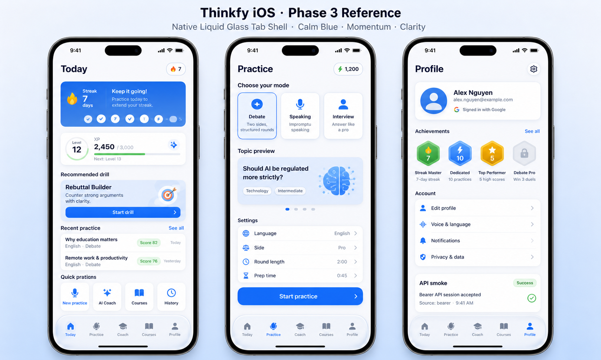
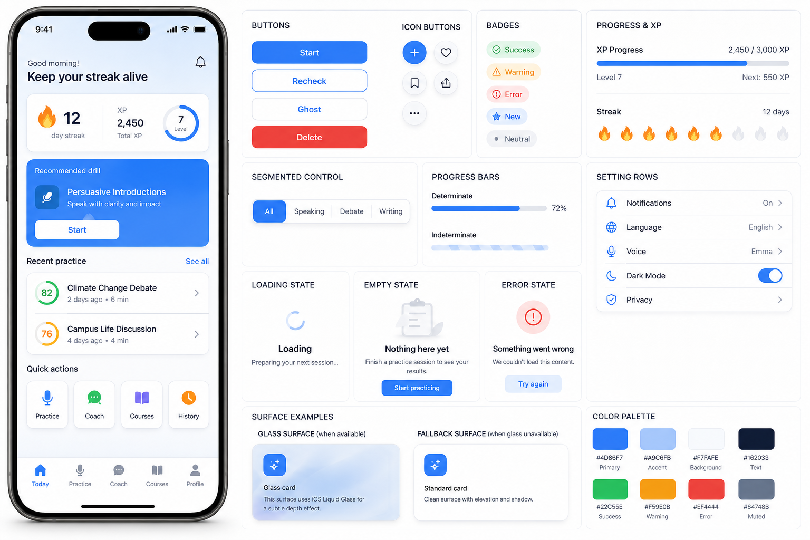
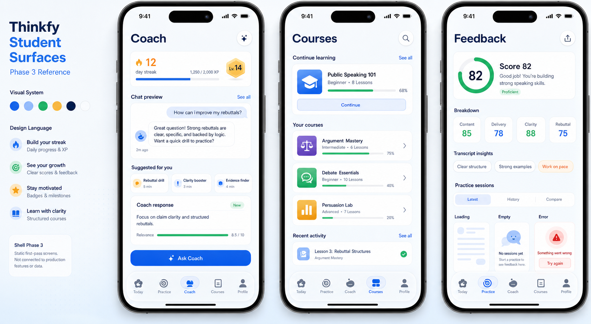

# Phase 3 UI Reference Board

Phase 3 generated three raster boards with built-in imagegen. These are visual references for the mobile shell and component system, not production screenshots.

## Generated Boards

### Liquid Glass Tab Shell



File: `ui-reference/liquid-glass-tab-shell-reference.png`

Prompt summary:

- Three iPhone screens: Today dashboard shell, Practice shell, and Profile diagnostic/settings shell.
- Native iOS Liquid Glass tab bar, SF Symbol-style icons, translucent system surface.
- Thinkfy calm blue system with restrained green progress and amber achievement accents.

Takeaways:

- Use native tabs as the main first-viewport signal after auth.
- Keep the top action clear on Today and use compact progress cues rather than a landing-page hero.
- Keep Profile practical: identity, provider, achievements, settings, and diagnostics.

### Mobile Component States



File: `ui-reference/mobile-component-states-reference.png`

Prompt summary:

- React Native primitives: buttons, surfaces, badges, progress, settings rows, loading/empty/error states, and glass fallback.
- 8px control/card radius, white surfaces, high contrast, no purple-first or beige/brown palette.

Takeaways:

- Build a small component surface now so later feature phases do not re-style every screen.
- State components must be visible and reusable before API-heavy phases begin.
- Glass should enhance surfaces but never be required for legibility.

### Student Surfaces



File: `ui-reference/student-surfaces-reference.png`

Prompt summary:

- Static first-pass Coach, Courses, and feedback/empty-state surfaces.
- Motivation through streaks, XP, badges, and momentum; clarity through structured lesson and feedback previews.

Takeaways:

- Coach should show suggested next actions even before full chat streaming.
- Courses should preview structured lesson states without wiring real progress data.
- Feedback states should stay compact and evidence-oriented for later Phase 7 work.

## Original Prompt Specs

### `liquid-glass-tab-shell-reference`

```text
Use case: ui-mockup
Asset type: Thinkfy Phase 3 iOS reference board for native Liquid Glass tab shell
Primary request: Create one polished UI reference board showing three iPhone screens for a student debate-learning app: Today dashboard shell, Practice shell, and Profile diagnostic/settings shell. The bottom navigation must look like Apple native Liquid Glass tabs on iOS 26: translucent system tab bar, SF Symbol-style icons, crisp labels, and content scrolling behind the tab bar.
Visual system: Thinkfy calm blue palette (#4D86F7, #A9C6FB, #F7FAFE), white surfaces, soft navy text (#162033), bright restrained green progress accents (#34C759), small amber warning accent (#F5B942). Friendly Duolingo-like momentum and streak motivation, Brilliant-like learning clarity and dense mobile ergonomics.
UI details: Today has streak, XP/level, recommended drill, recent practice, quick actions. Practice has mode cards, topic preview, language/mode controls. Profile has user/provider row, achievements, settings rows, API smoke diagnostic. Use 8px radius for compact cards/buttons, no nested cards, no oversized landing hero.
Composition/framing: one wide reference board with three readable iPhone mockups side by side, each full-screen. Mobile-native, polished, high fidelity.
Text: minimal English UI copy such as "Today", "Practice", "Profile", "Start drill", "Streak", "XP", "API smoke".
Constraints: no real brand logos, no cartoon mascots, no purple-first palette, no beige/brown theme, no web browser chrome, no tiny unreadable paragraphs, no watermark.
```

### `mobile-component-states-reference`

```text
Use case: ui-mockup
Asset type: Thinkfy Phase 3 mobile component states reference board
Primary request: Create one polished UI reference board showing React Native component primitives for Thinkfy iOS: buttons, cards/surfaces, badges, progress bars, segmented controls, setting rows, loading state, empty state, error state, and a guarded glass surface fallback.
Visual system: Thinkfy calm blue palette (#4D86F7, #A9C6FB, #F7FAFE), white surfaces, soft navy text (#162033), green success, amber warning, red error. Duolingo-like friendly progress energy plus Brilliant-like clean educational clarity. Compact 8px radii for controls and cards, not pill-heavy. Native iOS spacing and typography.
Composition/framing: one wide design board with a single large iPhone mockup and a component matrix beside it. Keep each component readable and uncluttered.
UI details: primary/secondary/ghost/destructive buttons, small icon buttons, status badges, XP progress, loading spinner with title, empty practice state, error retry state, setting rows with chevrons, glass card and non-glass fallback.
Text: minimal English UI copy such as "Start", "Recheck", "Empty", "Try again", "Loading", "Success", "Warning".
Constraints: no real brand logos, no mascot, no web browser chrome, no tiny unreadable paragraphs, no purple-first gradient, no beige/brown theme, no watermark.
```

### `student-surfaces-reference`

```text
Use case: ui-mockup
Asset type: Thinkfy Phase 3 student surfaces reference board
Primary request: Create one polished UI reference board showing three iPhone screens for static first-pass student surfaces: Coach tab, Courses tab, and Practice feedback/empty-state preview. These should be shell screens, not connected production features.
Visual system: Thinkfy calm blue palette (#4D86F7, #A9C6FB, #F7FAFE), white surfaces, navy text, green progress accents, amber achievement accents. Duolingo-like motivation through streaks, XP, badges, and momentum; Brilliant-like clarity through structured lessons, precise feedback, and compact scannable hierarchy.
UI details: Coach screen has chat preview, suggested action chips, response state card, and Ask Coach CTA. Courses screen has course progress, module cards, lesson/activity states, completion badge. Feedback/empty preview screen has score ring, rubric cards, transcript insight chips, loading/empty/error mini states.
Composition/framing: one wide board with three readable iPhone mockups side by side, each full-screen with native Liquid Glass bottom tab bar.
Text: minimal English UI copy such as "Coach", "Courses", "Feedback", "Continue", "Ask Coach", "Score 82", "Empty", "Try again".
Constraints: no real brand logos, no cartoon mascot, no web browser chrome, no unreadable tiny paragraphs, no purple-first palette, no beige/brown theme, no watermark.
```
