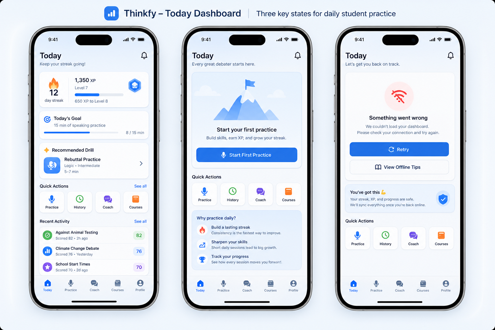

# Phase 4 UI Reference Board

## Selected Output

## Prompt

Create a polished mobile UI reference board for Thinkfy's live iOS Today dashboard. Style: calm blue Thinkfy visual system, modern iOS Liquid Glass feel, friendly Duolingo-like streak motivation, Brilliant-like learning clarity and focused progress. Show three adjacent iPhone screens in one raster board: 1) Today dashboard with streak, XP/level progress, today goal, and recommended speaking/debate drill; 2) empty starter dashboard for a new student with a clear first practice action; 3) dashboard error/retry state that still feels reassuring. Use dense mobile ergonomics suitable for daily student practice, rounded 8px-ish cards, native tab bar hint, no brand logos, no large marketing hero, no legible copyrighted text, no decorative blobs or purple/orange dominant palette. High-fidelity product mockup, clean spacing, accessible contrast.

## Implementation Takeaways

- The live dashboard should lead with daily motivation but stay compact enough for repeated use.
- Streak, XP, today goal, and recommended drill need to be visible without a second tap.
- Empty and error states should still feel like part of the product, not generic system failures.
- Quick actions should stay stable and thumb-friendly: Practice, Feedback/History, Coach, and Courses.
- Mobile copy should be short, concrete, and state-driven.
